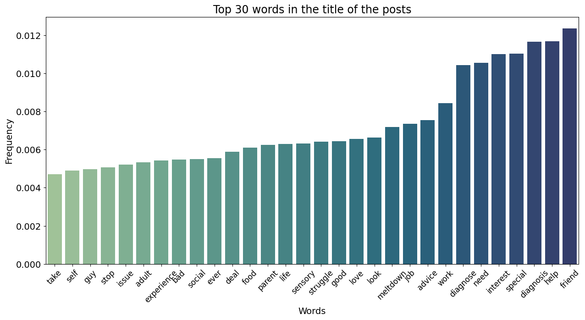
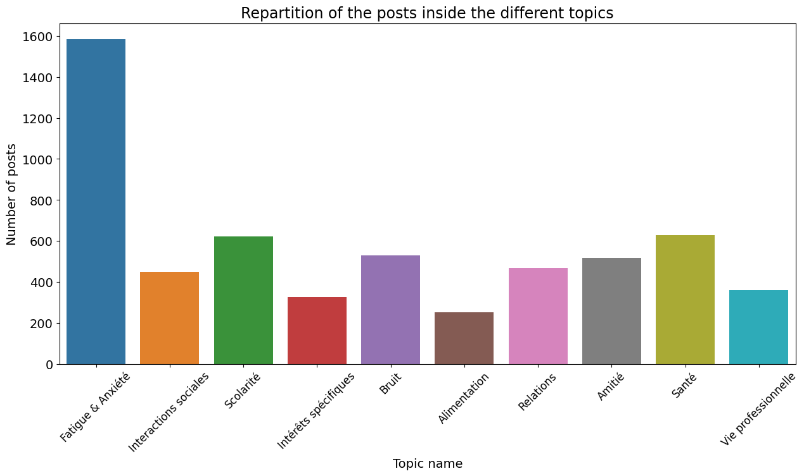
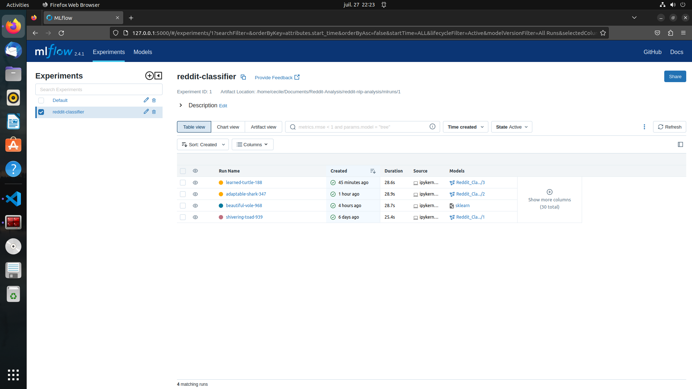

# Classification of Reddit posts about Autism

## Tables of contents 

- [General Info](#general-info)
- [Technologies](#technologies)
- [Credit](#credit)

## General Info

This project is an example of text data processing. The data was collected by a pipeline built in Python. The repository containing the code can be found [here](https://github.com/cecilegltslmcs/ETL-reddit). 
This NLP project consists of two parts. Firstly, the quantitative data were subjected to univariate and bivariate statistical analysis (mean, median and correlation). Textual data were analyzed using unsupervised algorithms (Tf-IDF, NMF for topic modeling). Then, a supervised algorithm was implemented to classify the different messages. Data labeling comes from unsupervised algorithms that help define certain topics. 
The next step in this project is to deploy the model so as to be able to regularly label new data and monitor prediction drift. 

## Technologies

- Python
- Jupyter Notebook
- Gensim, Pandas, Matplotlib, Numpy, NLTK, Seaborn, Scikit-Learn, Spacy
- Psycopg2, SQLAlchemy
- MLFlow

## Illustration

Here some illustrations coming from the textual analysis and the labelling of the data.

**Examples of illustration :**

*Top 30 after TF-IDF*

*Repartition of the 6 topics*

*ML Flow UI with Random Forest Classifier*

## Credit

- Cécile Guillot
